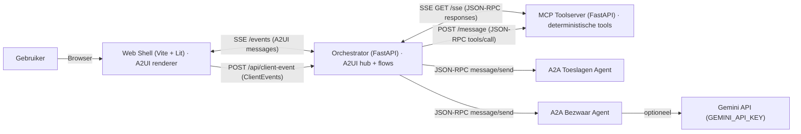
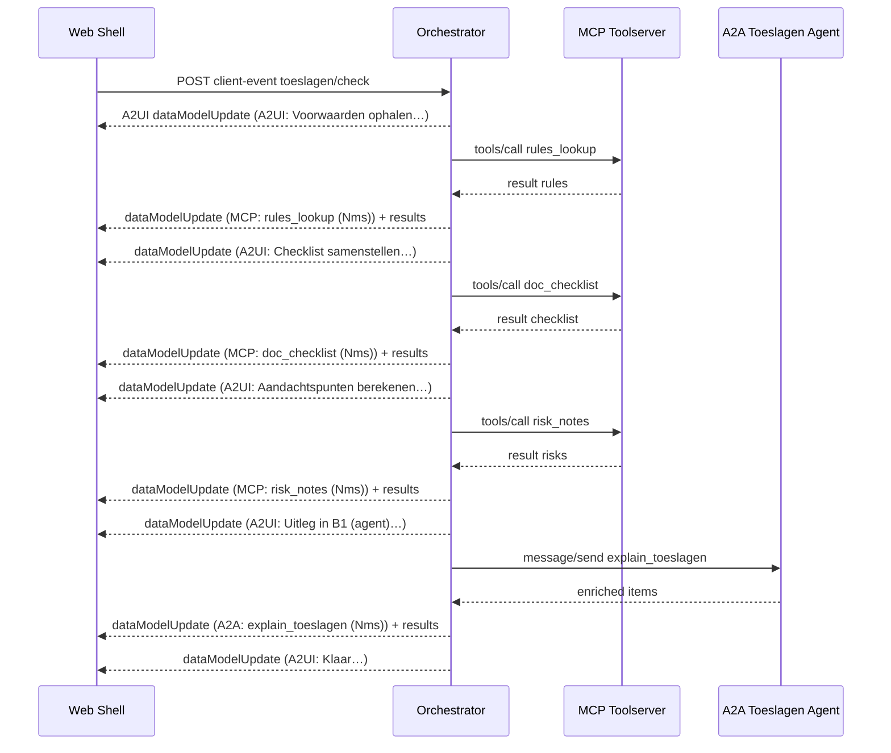
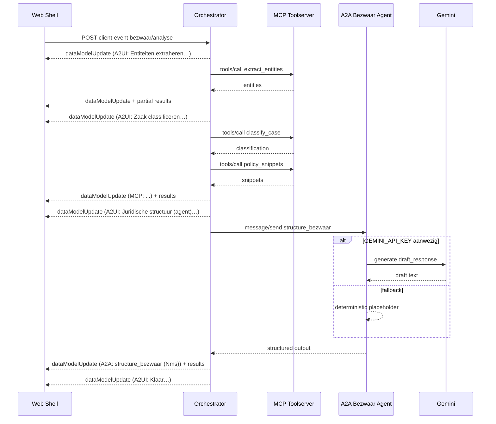
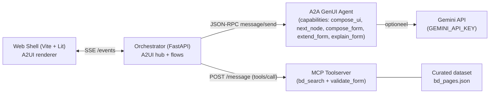
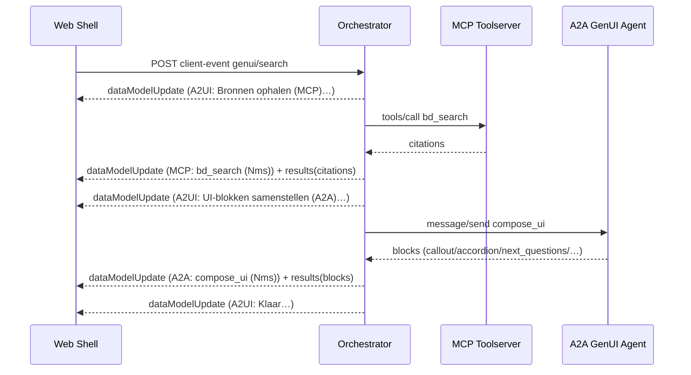
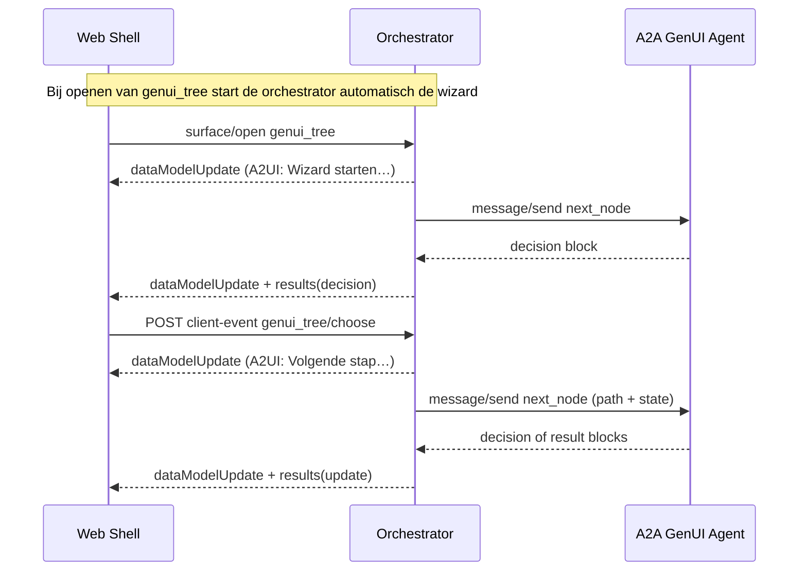
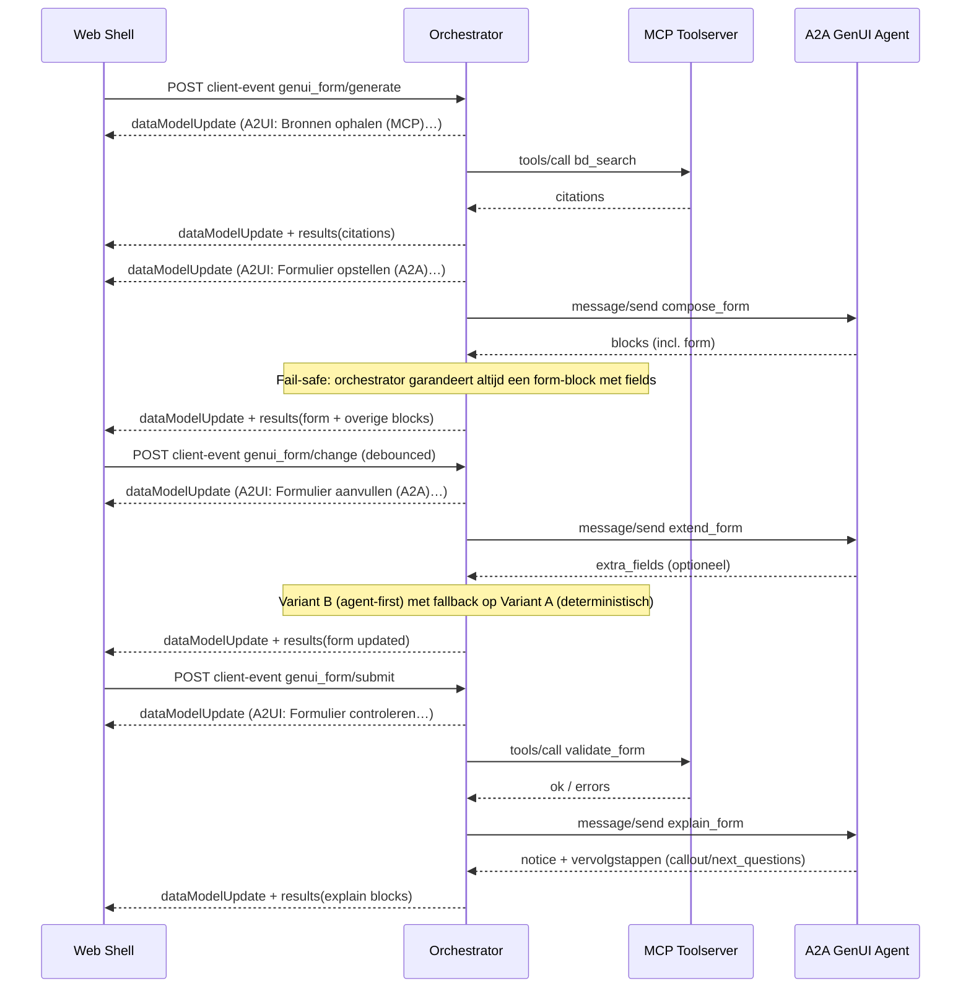
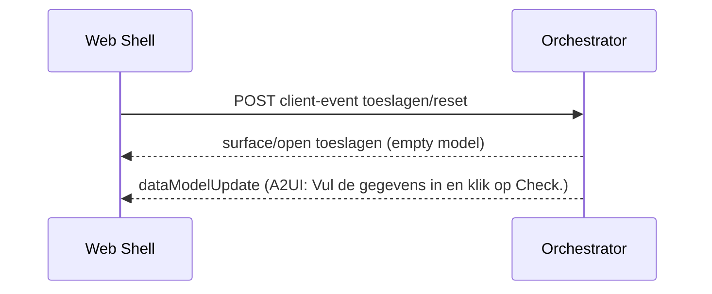

# Architectuur — Belastingdienst Assistants (MVP)

Deze MVP bestaat uit een web-shell (A2UI renderer), een orchestrator (A2UI SSE + flowlogica), een MCP toolserver (SSE transport) en twee A2A agents (JSON-RPC). De Bezwaar-agent kan optioneel Gemini gebruiken.

## Componentdiagram (Mermaid)

## Sequence — Toeslagen Check (progressive updates)

## Sequence — Bezwaar Assistent (Gemini optioneel)

---

# Aanvullingen — GenUI (Zoeken / Wizard / Formulier)

Onderstaande diagrammen voegen de nieuwe GenUI-stromen toe. De bestaande diagrammen hierboven blijven ongewijzigd.

## Component-aanvulling — GenUI (Mermaid)

## Sequence — GenUI Zoeken (progressive updates)

## Sequence — GenUI Wizard (decision tree)

## Sequence — GenUI Formulier (generate / change / submit)

## Sequence — Toeslagen Reset

## Notities — stabiliteit en fallback

- **Event-aliases:** de orchestrator accepteert (waar relevant) zowel `genui/form_*` als `genui_form/*` varianten om UI/flow-compatibiliteit te behouden.
- **Whitelisting/sanitizing:** de orchestrator laat alleen toegestane block-kinds door (o.a. `form`, `decision`, `callout`, `notice`, `next_questions`, `citations`).
- **Fail-safe formulier:** ook als `compose_form` geen (bruikbaar) form-block oplevert, injecteert de orchestrator een deterministisch form-block zodat de demo altijd invulvelden toont.
- **Variant B + pruning:** toegevoegde velden kunnen ook weer verdwijnen wanneer triggers wegvallen (bijv. bedrag leeg/0, kenmerk te kort).
