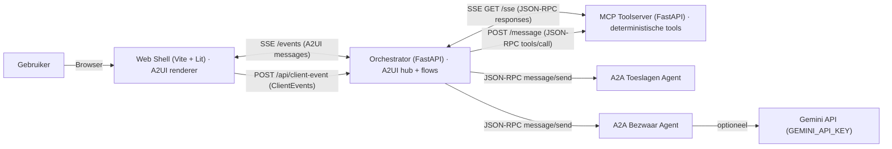

# Architectuur — Belastingdienst Assistants (MVP)

Deze MVP bestaat uit een web-shell (A2UI renderer), een orchestrator (A2UI SSE + flowlogica), een MCP toolserver (SSE transport) en twee A2A agents (JSON-RPC). De Bezwaar-agent kan optioneel Gemini gebruiken.

## Componentdiagram (Mermaid)

