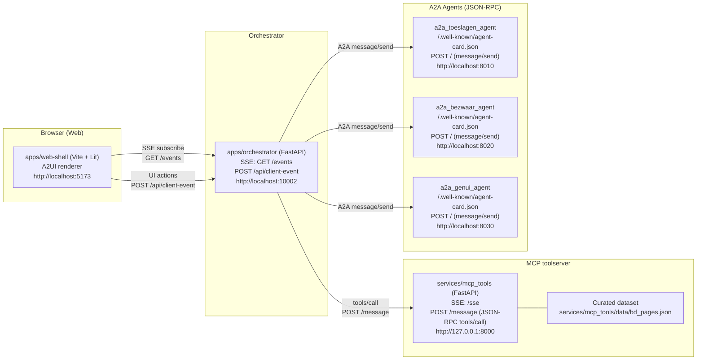

# Belastingdienst Assistants — Architecture

Deze repo is een **standalone demo-MVP** (“Belastingdienst Assistants”) met een minimale, maar complete end‑to‑end keten voor:
- **A2UI** (UI opgebouwd uit data/blocks)
- **MCP** (deterministische tools)
- **A2A** (agent-calls via JSON‑RPC)
- **Orchestrator** (FastAPI + SSE, stuurt progressive UI updates)

Doel: een stabiele demo die ook **zonder Gemini** volledig werkt (fallbacks), met optionele model-ondersteuning zodra quota beschikbaar is.

---

## 1. Component-overzicht

---

## 2. Runtime endpoints & poorten

| Component | Pad | Default |
|---|---|---|
| Web shell | `apps/web-shell` | `http://localhost:5173` |
| Orchestrator | `apps/orchestrator` | `http://localhost:10002` |
| MCP toolserver | `services/mcp_tools` | `http://127.0.0.1:8000` |
| A2A Toeslagen | `services/a2a_toeslagen_agent` | `http://localhost:8010` |
| A2A Bezwaar | `services/a2a_bezwaar_agent` | `http://localhost:8020` |
| A2A GenUI | `services/a2a_genui_agent` | `http://localhost:8030` |

Configuratie via `.env` (zie `.env.example`).

---

## 3. A2UI: surfaces & data model

### 3.1 Surfaces (UI routes)
- `home`
- `toeslagen`
- `bezwaar`
- `genui_search` (GenUI: zoeken)
- `genui_tree` (GenUI: wizard/decision tree)
- `genui_form` (GenUI: formulier, incl. Variant A/B)

### 3.2 Belangrijkste model paths
- `/status/loading` (bool)
- `/status/message` (string)
- `/status/step` (string)
- `/status/lastRefresh` (timestamp)
- `/status/source` (bijv. `gemini`/`fallback`)
- `/status/sourceReason` (bijv. `bad_json`, `resource_exhausted`, `deterministic_form_extend`)
- `/results` (lijst van A2UI blocks)

De web-shell rendert status + results zonder batching, met progressive updates (kleine delays).

---

## 4. A2UI blocks (whitelist + defensieve checks)

De orchestrator valideert/sanitized GenUI output (whitelist) zodat de demo nooit crasht door onverwachte JSON.

**Allowed kinds (kern):**
- `citations`
- `callout`
- `notice`
- `accordion`
- `next_questions`
- `decision` (wizard)
- `form` (formulier)

**Form field types (kern):**
- `text`, `textarea`, `email`, `number`, `date`, `select`

Onbekende kinds/velden worden verwijderd of genormaliseerd.

---

## 5. Gebruikscases en datastromen

### 5.1 Toeslagen Check (tile)
**Doel:** MCP tools + A2A uitleg.

1. Web → Orchestrator: `toeslagen/check`
2. Orchestrator → MCP: `rules_lookup`, `doc_checklist`, `risk_notes`
3. Orchestrator → A2A Toeslagen: `explain_toeslagen`
4. Orchestrator → Web via SSE: progressive status + blocks

**Reset**
- Web → Orchestrator: `toeslagen/reset`
- Orchestrator opent surface opnieuw met leeg model (`results=[]`, status idle)

---

### 5.2 Bezwaar Assistent (tile)
**Doel:** MCP extract/classify + A2A conceptbrief.

1. Web → Orchestrator: `bezwaar/start`
2. Orchestrator → MCP: `extract_entities`, `classify_case`, `policy_snippets`
3. Orchestrator → A2A Bezwaar: `structure_bezwaar` (Gemini optioneel; fallback aanwezig)
4. Orchestrator → Web via SSE: progressive updates

---

### 5.3 GenUI — Zoeken (tile)
**Doel:** deterministische search + GenUI blocks.

1. Web → Orchestrator: `genui/search`
2. Orchestrator → MCP: `bd_search` (curated dataset)
3. Orchestrator → A2A GenUI: `compose_ui` (Gemini optioneel; fallback aanwezig)
4. Orchestrator zet `/status/source` + `/status/sourceReason`
5. Web toont “GenUI: Gemini/Fallback · reason”

---

### 5.4 GenUI — Wizard (tile)
**Doel:** agentic UI met `decision` blocks.

1. Web opent `genui_tree`
2. Orchestrator auto-start (eerste binnenkomst): `genui_tree/start`
3. Orchestrator → A2A GenUI: `next_node` (deterministisch fallback)
4. Web rendert `decision` blocks; keuze → `genui_tree/choose`

---

### 5.5 GenUI — Formulier (tile)
**Doel:** “form-on-the-fly” + validatie + dynamische velden.

#### Generate
1. Web → Orchestrator: `genui_form/generate` (aliases worden geaccepteerd)
2. Orchestrator → MCP: `bd_search` (citations)
3. Orchestrator → A2A GenUI: `compose_form`
4. **Fail-safe:** Orchestrator zorgt dat er **altijd** een `form` block met `fields` in `/results` zit (fallback injection).

#### Submit
1. Web → Orchestrator: `genui_form/submit` met `values`
2. Orchestrator → MCP: `validate_form` (deterministisch)
3. Orchestrator → A2A GenUI: `explain_form` (deterministisch fallback)
4. Web ziet notice + vervolgstappen (callout/next_questions)

#### Variant A vs Variant B (dynamische velden)
- **Variant A (deterministisch):** orchestrator voegt velden toe op basis van triggers.
- **Variant B (agent-first):** orchestrator vraagt A2A GenUI capability `extend_form` om `extra_fields`.
  - Als A2A faalt/geen output: fallback op Variant A.

**Pruning:** als de trigger weer wegvalt (veld leeg/0), verdwijnen de toegevoegde velden weer.

---

## 6. Protocols

### 6.1 Web ↔ Orchestrator
- SSE: `GET /events` (progressive model updates)
- Client events: `POST /api/client-event` met `{ sessionId, surfaceId, name, data }`

### 6.2 Orchestrator ↔ MCP
- SSE transport + JSON‑RPC `tools/call` via `POST /message`

### 6.3 Orchestrator ↔ A2A Agents
- JSON‑RPC `message/send` via `POST /`
- Agent card: `/.well-known/agent-card.json`

---

## 7. Error handling & fallback policy

- **Gemini quota / bad JSON:** GenUI/Bezwaar kunnen terugvallen op deterministische output.
- **Whitelisting/sanitizing:** voorkomt UI crashes door onverwachte blocks.
- **Fail-safe Form:** “Genereer formulier” levert altijd invulvelden (ook bij lege A2A output).

---

## 8. Run scripts (Windows/Git Bash)

- `scripts/run_all.sh` — start MCP + agents + orchestrator + web
- `scripts/run_a2a.sh` — start agents
- `scripts/run_a2a_genui.sh` — start alleen GenUI agent

---

## 9. Security & demo-randvoorwaarden

- Geen PII in demo; gebruik placeholders.
- Dataset is curated/gesimuleerd (geen echte systemen of echte klantdata).
- Logging is bewust beknopt voor demo.
